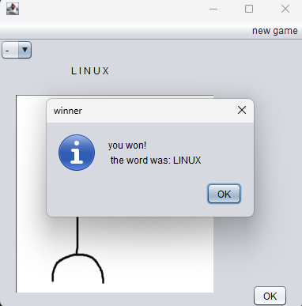
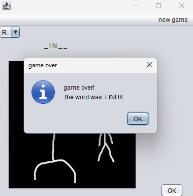

# Hangman

## Overview

This is a classic Hangman game where you can challenge yourself or friends by guessing letters to uncover a secret word

## How to Play

1. **Start a new game:** Click "new game" to begin.

 

2. **Enter the secret word:** Input the word to be guessed.
The game stores this word and converts it into a character array for processing.

  

 

3. **Guess letters:** Use the dropdown menu in the top-left corner to select a letter, then press "OK" to submit your guess.
    - Used letters get removed from the dropdown.

 

4. **Game logic:**
    - If your guess is correct, the corresponding letter(s) in the secret word will be revealed.
    - If your guess is incorrect, the hangman drawing will advance one step closer to completion.

 

5. **Winning or losing:**
    - Guess all the letters correctly before the hangman is fully drawn, and you win!

      

    - Fail to guess the word and you lose.

      